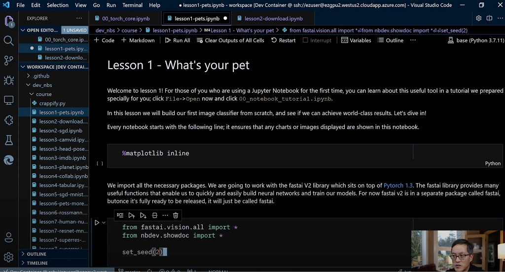

# ez

Commands for working with portable environments

## Why do you need it?

Imagine that you have a project, it runs on your computer, and you've created
a GitHub repo for it. What if you wanted to keep working on that same project
on another computer - could you do that? Before you say yes, here are some
things that you might need to do:

- install software/packages that your project needs to run
- install drivers if your project needs specialized hardware like a GPU
- mount an external file share that contains files that your project needs
- manage secrets for talking to services like GitHub
- configure your VS Code environment

None of those things adds any value to your life beyond getting your project
to run. Those things are time consuming and error-prone. It is hard to 
_reproduce_ your project on the other computer.

`ez` does all this for you by creating what we call a _portable environment_.
Once you have something working on a computer, the _portable environment_ can
be used to move your work to another computer without you needing to do
any additional work or make any changes to your code.

Imagine that you have been working on a machine learning model locally, but
you now need to train that model using the full dataset using more compute
resources on Azure. `ez` lets you do that with just a single command without
needing to have a devops engineer set everything up for you!

## What is it?

`ez` is a command line tool that lets you run GitHub repos on your local
computer or on Azure. This is the every-day command that you'll use in `ez`:

```sh
$ ez env go git@github.com:/jflam/fastai -c computer_name
```

There are two parameters to `ez env go`:

- the URI of a GitHub repo that you want to run
- the name of a computer that you want to run that repo on

`ez` will open the GitHub repo on `computer_name` and start a VS Code session
bound to the contents of that GitHub repo. 



You can do anything that you would normally do on a computer that you
configured yourself:

- you can commit changes back to your GitHub repo without needing to first
  setup your GitHub SSH keys
- you can read/write to files on a drive that is mounted into that repo - that
  drive can be accessed from other machines, or your local machine
- you can just run the code right away without needing to install additional
  software or libraries, provided that the repo has some _metadata_ that `ez`
  can use to create the Docker container image that it uses to run it
- you can SSH into that Docker container from a local machine without needing
  to configure SSH keys or remember anything other than `computer_name`
- you can copy files to/from that Docker container without needing to know
  anything more than some basic `scp` syntax

Click on the image beelow to watch this 3.5 minute video to see `ez` in action:

[](http://www.youtube.com/watch?v=u1nmx2rd5Jk "Getting Started with ez and fast.ai")

WARNING: this is a proof-of-concept and is not production software. Think of
this as more of a prototype that can be used to better understand the problems
you have - a running spec if you will. Please do create issues so we can start
having some conversations about the things that will need to be done to 
satisfy real-work workflows.

## Getting Started

`ez` is still a prototype and very much a work in progress. It also has
a large number of dependencies on other software that needs to be present
on the system. Help would be welcome in building a more robust installation
procedure!

### Pre-requisites

Before you can install `ez`, you will need a working Docker installation on
your computer. You can download [Docker from
here](https://www.docker.com/products/docker-desktop). Note that Docker
Desktop is not free software, so please read the licensing terms carefully.

If you are running Linux under WSL 2 on Windows, you must enable the [WSL 2 
backend](https://docs.docker.com/desktop/windows/wsl/) for Docker.

On Mac, you will also need a working [Homebrew](https://brew.sh/)
installation.

### On Windows Support

`ez` has not been tested running on Windows, and likely will not run at all in
its current state. If you are running Windows, enable WSL 2 and install Linux
and run `ez` from there. I realize that Windows support is important to many
and it is fairly ironic that I, an alumni of the Windows team, have not spent
any time working on Windows support for `ez`. Help would be welcome in
building out the Windows support!

To be clear, I use Windows probably 75% of the time in developing `ez`. It's
just that I do all of my work on Ubuntu 20.04 running under WSL 2 on Windows.

### Python 3.8+ required

If you have a working Python >= 3.8 installation on Linux or Mac, you should
use these scripts to install:

- Mac
- Linux

If you don't have a working Python on Linux or Mac, these scripts will install
Python for you in addition to installing `ez`:

Linux:

```sh
curl --remote-name https://raw.githubusercontent.com/jflam/ez/main/src/pre-install.sh 
bash pre-install.sh
```

Mac:

```sh
curl --remote-name https://raw.githubusercontent.com/jflam/ez/main/src/pre-install-mac.sh 
bash pre-install-mac.sh
```

Additional software in addition to `ez` that is installed by the script
include:

The script:

1. Installs a few dependencies: `git`, `curl`
1. Installs `Miniconda3`
1. Generates two SSH keys: `id_rsa_azure` and `id_rsa_github` that will be
   used to connect to GitHub and connect to resources that you create with
   Azure. You can choose to use an existing key when configuring `ez` later.
1. Install the [Azure CLI](https://docs.microsoft.com/en-us/cli/azure/)
1. Install the [GitHub CLI](https://cli.github.com/)
1. Logs into GitHub and Azure
1. Installs `ez` by cloning this repo
1. Initializes `ez`

If you have both of these installed already, you may just want to clone the 
`ez` GitHub repo and run this:

```sh
cd ez/src
python setup.py install
```

If you want to modify the code, pass `develop` instead of `install` as a
parameter to `setup.py`.  This will make it possible to continue to develop
locally and have your changes immediately reflected each time you run `ez`
from any directory.

## How It Works
